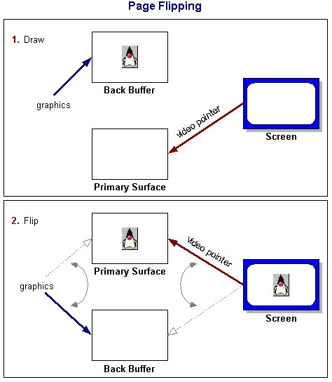
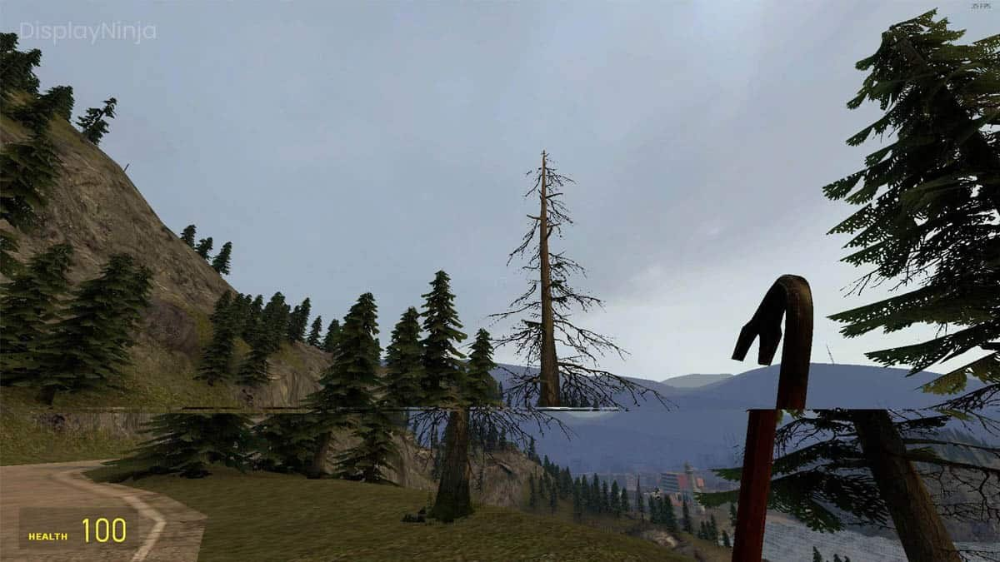

+++
title = "Double Buffer Pattern"
date = 2024-09-01
description = "An essential graphics technique that eliminates screen tearing by rendering frames to an off-screen buffer before displaying them."
[taxonomies]
tags = ["Game Development", "Graphics", "Rendering", "Double Buffering", "Performance", "C++", "Rust", "Game Programming Patterns"]

[extra]
sources = [
    "https://gameprogrammingpatterns.com/double-buffer.html"
]
+++

# Double Buffer Pattern in Game Programming

When we develop games, we need to create smooth, seamless visuals that update instantly. But computers work sequentially, processing one thing at a time. How do we bridge this gap?

Enter the double buffer pattern.

**Double buffering** is a technique that creates the illusion of instantaneous updates in a sequential system.

# How does it work?

Imagine you're painting a mural, but people are constantly looking at your work. You don't want them to see your half-finished strokes, right? So you use two canvases:

- The "next" canvas: This is where you do all your painting.
- The "current" canvas: This is what people see.

*When you finish painting, you quickly swap the canvases.* **Voila!** The viewers see a complete new image, with no idea of the work-in-progress. *In computer terms:*

- "Next" buffer: Where the game writes new frame data.
- "Current" buffer: What the video driver reads to display on screen.
- Swap operation: Instantly switches the two buffers.



## Swapping buffers

There are different types of swapping depending on implementation:

- pointer swap
- swap with copy

Keep in Mind

- The swap operation must be atomic and can take time
- You need memory for two complete copies of the state

# Why is this important?



Without double buffering, we'd see visual glitches called "tearing". Imagine seeing half of a character's old position and half of their new position - not a smooth experience!

```c++
// A simple implementation in cpp
Scene {
public:
  Scene()
    : current_(&buffers_[0]),
      next_(&buffers_[1])
  {}

  void draw() {
    next_->clear();
    // Draw operations here
    swap();
  }

  Framebuffer& getBuffer() { return *current_; }

private:
  void swap() {
    Framebuffer* temp = current_;
    current_ = next_;
    next_ = temp;
  }

  Framebuffer buffers_[2];
  Framebuffer* current_;
  Framebuffer* next_;
};
```

# Conclusion

Almost every graphics API uses double buffering. Moreover, modern games even
have triple-buffering, as name suggest they swap 3 buffers. However, there is
input lag. As a finishing words I want to present some of the work I have done
folling with pattern:

[game-of-life](https://github.com/4ry1337/mini-projects/tree/master/game-of-life):
<video width="100%" height="100%" muted loop autoplay>
  <source src="./double_buffering_example_1.mp4" type="video/mp4">
</video>


[cube](https://github.com/4ry1337/mini-projects/tree/master/cube):
<video width="100%" height="100%" muted loop autoplay>
  <source src="./double_buffering_example_2.mp4" type="video/mp4">
</video>

